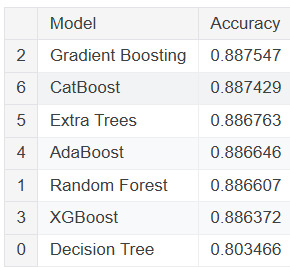

# Ex.No: 13 Loan Approval Prediction – Use Supervised Learning  
### DATE:                                                             
### REGISTER NUMBER : 212222040014

## AIM

The aim of this project is to develop a machine learning-based heart disease prediction system. The system uses a dataset of patient health metrics to predict the likelihood of heart disease, assisting healthcare professionals in making informed decisions based on the analysis of key risk factors.

## Algorithm

1. Start the program.
2. Import necessary packages, including NumPy, Pandas, and Sklearn for data handling, model building, and evaluation, as well as Streamlit for creating the user interface.
3. Load the heart disease dataset using Pandas.
4. Check for missing values in the dataset. Handle any missing values by filling with median values or dropping rows if necessary.
5. Split the data into input features (X) and the target label (Y), where Y represents the presence or absence of heart disease.
6. Divide the data into training and testing sets using the `train_test_split` function from Sklearn.
7. Standardize the features in both training and testing sets using `StandardScaler` to ensure they have a mean of 0 and a standard deviation of 1.
8. Choose a classifier, such as Random Forest or Logistic Regression, and train it on the training data.
9. Test the model’s accuracy by making predictions on the test set and calculating accuracy using `accuracy_score`.
10. Define a `predict_heart_disease` function that takes user input for the required features and outputs the model's prediction.
11. Build an interactive interface using Streamlit where users can input their data and view the prediction result.
12. Deploy the Streamlit app for online access, enabling users to interact with the heart disease prediction model.
13. Stop the program.

## Program

```python
pip install --upgrade numba ydata-profiling visions
import pandas as pd 
import plotly.express as px
from ydata_profiling import ProfileReport
from sklearn.preprocessing import LabelEncoder

df = pd.read_csv('/kaggle/input/loan-default/Loan_default.csv')
df

df.info()

df.isnull().sum()

eda = ProfileReport(df , dark_mode= True , title = 'EDA REPORT ')
eda

# DROPING THE ID COLUMN SINCE IT IS NOT USEFUL FOR MODELING 
df.drop('LoanID' ,axis = 1 , inplace=True)

df.columns

col = ['Income', 'LoanAmount']

for i in col:
    fig = px.box(df , y = i , title  = f'BOX PLOT FOR {i}')
    fig.show()

# FEATURES ENGINEERING 

df['LoanToIncomeRatio'] = df['LoanAmount'] / df['Income']

df['CreditUtilizationRate'] = df['LoanAmount'] / df['CreditScore']

col = ['LoanToIncomeRatio' ,'CreditUtilizationRate']

for i in col:
    fig = px.box(df , y=i)
    fig.show()

from sklearn.preprocessing import LabelEncoder

# Initialize LabelEncoder
label_encoder = LabelEncoder()

# List of binary columns
binary_columns = ['HasMortgage', 'HasDependents', 'HasCoSigner']

# Apply LabelEncoder to binary columns
for col in binary_columns:
    df[col] = label_encoder.fit_transform(df[col])

# One-hot encoding categorical columns
categorical_columns = ['Education', 'EmploymentType', 'MaritalStatus', 'LoanPurpose']

# Apply one-hot encoding
df = pd.get_dummies(df, columns=categorical_columns, drop_first=True).astype(float)  # drop_first=True avoids multicollinearity

from sklearn.preprocessing import MinMaxScaler

# List of numerical columns to scale
numerical_columns = ['Age', 'Income', 'LoanAmount', 'CreditScore', 'MonthsEmployed', 
                     'NumCreditLines', 'InterestRate', 'LoanTerm', 'DTIRatio', 'LoanToIncomeRatio' , 'CreditUtilizationRate']

# Initialize scaler
scaler = MinMaxScaler()


# Fit and transform the numerical columns
df[numerical_columns] = scaler.fit_transform(df[numerical_columns])

# Check the scaled data
df.head()

# Import necessary library
from sklearn.model_selection import train_test_split

# Split the dataset into features and target variable
X = df.drop('Default', axis=1)  # Features
y = df['Default']  # Target variable

# Train-test split (80% train, 20% test)
X_train, X_test, y_train, y_test = train_test_split(X, y, test_size=0.2, random_state=42)

# Print the shape of the resulting datasets
print("Training set shape:", X_train.shape)
print("Testing set shape:", X_test.shape)

# Import necessary libraries
from sklearn.metrics import accuracy_score, classification_report, confusion_matrix
from sklearn.tree import DecisionTreeClassifier
from sklearn.ensemble import RandomForestClassifier, GradientBoostingClassifier, AdaBoostClassifier, ExtraTreesClassifier
from xgboost import XGBClassifier
import lightgbm as lgb
from catboost import CatBoostClassifier

# Decision Tree Classifier
dt_model = DecisionTreeClassifier(random_state=42)
dt_model.fit(X_train, y_train)

# Predict on the test set
dt_predictions = dt_model.predict(X_test)

# Evaluation
print("Decision Tree Classifier:")
print("Accuracy:", accuracy_score(y_test, dt_predictions))
print("Classification Report:\n", classification_report(y_test, dt_predictions))
print("Confusion Matrix:\n", confusion_matrix(y_test, dt_predictions))

# Random Forest Classifier
rf_model = RandomForestClassifier(random_state=42)
rf_model.fit(X_train, y_train)

# Predict on the test set
rf_predictions = rf_model.predict(X_test)

# Evaluation
print("Random Forest Classifier:")
print("Accuracy:", accuracy_score(y_test, rf_predictions))
print("Classification Report:\n", classification_report(y_test, rf_predictions))
print("Confusion Matrix:\n", confusion_matrix(y_test, rf_predictions))

# Gradient Boosting Classifier
gb_model = GradientBoostingClassifier(random_state=42)
gb_model.fit(X_train, y_train)

# Predict on the test set
gb_predictions = gb_model.predict(X_test)

# Evaluation
print("Gradient Boosting Classifier:")
print("Accuracy:", accuracy_score(y_test, gb_predictions))
print("Classification Report:\n", classification_report(y_test, gb_predictions))
print("Confusion Matrix:\n", confusion_matrix(y_test, gb_predictions))

# XGBoost Classifier
xgb_model = XGBClassifier(use_label_encoder=False, eval_metric='logloss', random_state=42)
xgb_model.fit(X_train, y_train)

# Predict on the test set
xgb_predictions = xgb_model.predict(X_test)

# Evaluation
print("XGBoost Classifier:")
print("Accuracy:", accuracy_score(y_test, xgb_predictions))
print("Classification Report:\n", classification_report(y_test, xgb_predictions))
print("Confusion Matrix:\n", confusion_matrix(y_test, xgb_predictions))

# Extra Trees Classifier
et_model = ExtraTreesClassifier(random_state=42)
et_model.fit(X_train, y_train)

# Predict on the test set
et_predictions = et_model.predict(X_test)

# Evaluation
print("Extra Trees Classifier:")
print("Accuracy:", accuracy_score(y_test, et_predictions))
print("Classification Report:\n", classification_report(y_test, et_predictions))
print("Confusion Matrix:\n", confusion_matrix(y_test, et_predictions))

# CatBoost Classifier
cat_model = CatBoostClassifier(silent=True, random_state=42)
cat_model.fit(X_train, y_train)

# Predict on the test set
cat_predictions = cat_model.predict(X_test)

# Evaluation
print("CatBoost Classifier:")
print("Accuracy:", accuracy_score(y_test, cat_predictions))
print("Classification Report:\n", classification_report(y_test, cat_predictions))
print("Confusion Matrix:\n", confusion_matrix(y_test, cat_predictions))

# Performance summary
results = {
    "Model": ["Decision Tree", "Random Forest", "Gradient Boosting", "XGBoost", "AdaBoost", "Extra Trees", "CatBoost"],
    "Accuracy": [
        accuracy_score(y_test, dt_predictions),
        accuracy_score(y_test, rf_predictions),
        accuracy_score(y_test, gb_predictions),
        accuracy_score(y_test, xgb_predictions),
        accuracy_score(y_test, ada_predictions),
        accuracy_score(y_test, et_predictions),
        accuracy_score(y_test, cat_predictions)
    ]
}


results_df = pd.DataFrame(results)
results_df.sort_values(by='Accuracy', ascending=False)


```

### Output:




### Result:
Thus the system was trained successfully and the prediction was carried out.
